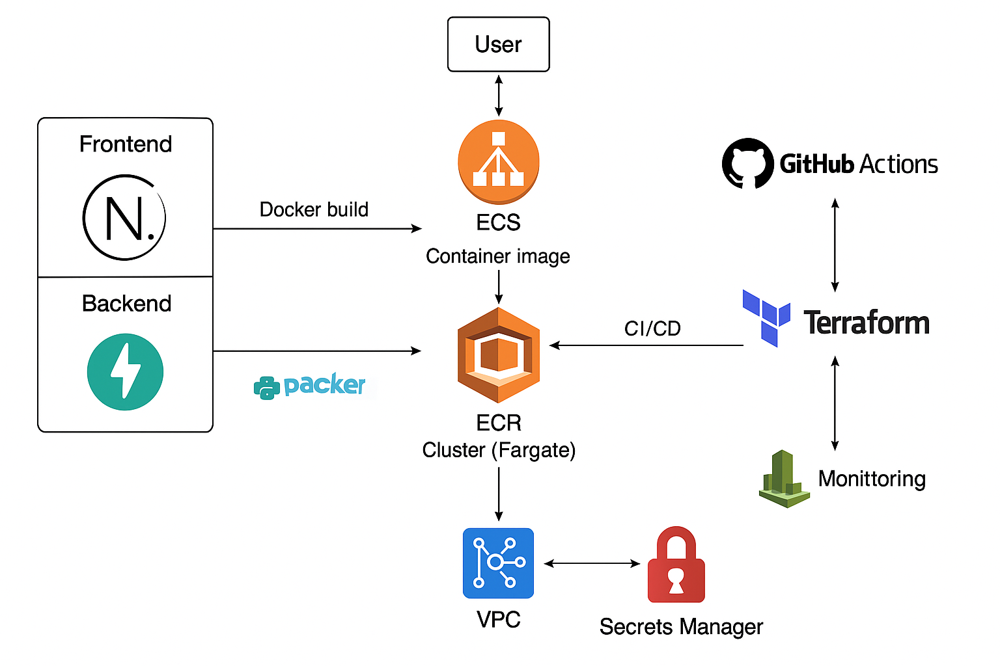

# 🚀 DevOps Assignment: Full-Stack Deployment with CI/CD, Terraform, and AWS

This project demonstrates a full-stack deployment workflow using:

- **Frontend:** Next.js (React)
- **Backend:** FastAPI (Python)
- **Containerization:** Docker (multi-stage builds)
- **Infrastructure:** AWS ECS (Fargate), ALB, Secrets Manager
- **IaC:** Terraform
- **CI/CD:** GitHub Actions

---

## 📦 Project Structure

```
DevOps-Assignment/
├── frontend/        # Next.js frontend (port 3000)
├── backend/         # FastAPI backend (port 8000)
├── terraform/       # Terraform IaC setup
├── .github/workflows/
│   └── ecr-push.yml # CI/CD pipeline to build & push Docker images
└── README.md
```

---

## 🌍 Hosted Links

| Component | URL |
|----------|-----|
| 🖥️ Frontend | [http://devops-assignment-alb-<...>.ap-south-1.elb.amazonaws.com](http://devops-assignment-alb-335229884.ap-south-1.elb.amazonaws.com/) |
| 🔗 Backend Health | [http://devops-assignment-alb-<...>.ap-south-1.elb.amazonaws.com/api/health](http://devops-assignment-alb-335229884.ap-south-1.elb.amazonaws.com/api/health) |


"I might take down the link after few days, its costing me money"
---

## ⚙️ Architecture Overview



1. Code pushed to `develop` → triggers GitHub Actions
2. Docker images built & pushed to Amazon ECR
3. Terraform provisions ECS + ALB + networking
4. Frontend & backend services auto-deployed on ECS Fargate
5. Load Balancer routes traffic to respective targets
6. Secrets fetched securely from AWS Secrets Manager
7. Monitoring via CloudWatch Dashboards and Alarms

---

## 🔁 Git Workflow

```bash
git checkout -b feature-branch
# make changes
git commit -m "🚀 Add feature"
git push origin feature-branch
# open pull request to 'develop'
```
---

## 🎥 Demo Video

A complete walkthrough covering:

- Project architecture and GitHub workflow
- Dockerization strategy (multi-stage builds)
- CI/CD flow via GitHub Actions
- Infrastructure provisioning via Terraform
- AWS monitoring (CloudWatch) and alerting setup
- Security measures (IAM roles, Secrets Manager)
- Live test of frontend ↔ backend integration

👉 [Watch the demo video](https://youtu.be/-GJ1G1PKEbM)

---

---

## 🔐 Security

- IAM roles grant **least privilege** to ECS tasks
- Secrets like API keys are stored in **AWS Secrets Manager**
- Only ECS tasks can fetch secrets (via IAM permissions)

---

## 📈 Monitoring

- CloudWatch Dashboard with:
  - CPU & memory metrics (frontend + backend)
  - Request count via ALB
- Alert set up:
  - 📩 Email notification if CPU > 70% for 5 minutes

---

## 🧪 How to Test

- Visit the frontend URL → should show backend integration
- Visit `/api/health` → should return status JSON
- Trigger `terraform apply` to see live infra provisioning
- Watch GitHub Actions for CI/CD build logs

---

## 📦 Terraform Evidence

- See `/terraform/terraform.tfstate`
- All `.tf` files in `/terraform` define your AWS infrastructure
- Logs of successful `terraform apply` available via screenshots or GitHub Releases

---

## 🤝 Contributors

- 👨‍💻 Mustafa Miyaji

---

## 📜 License

MIT
